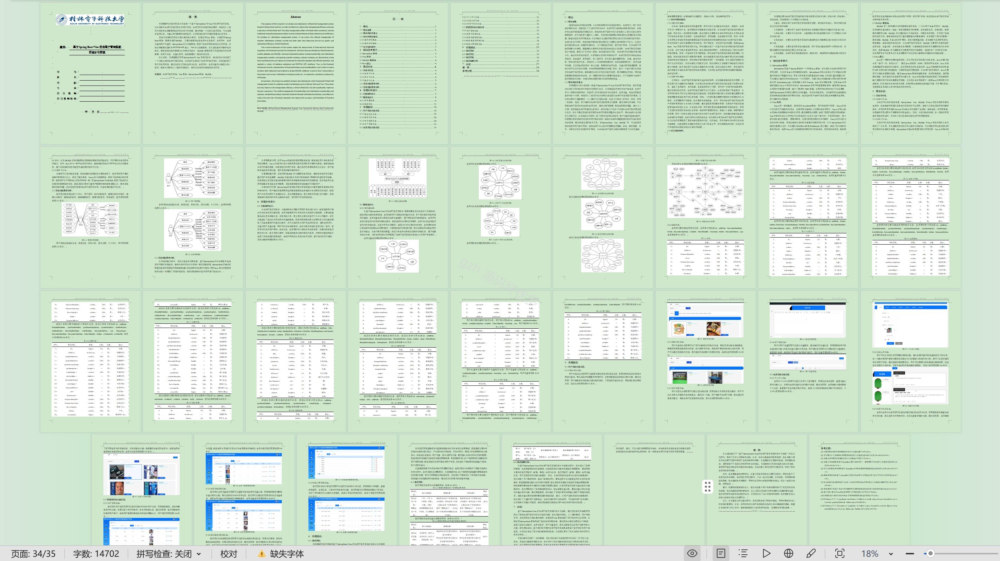

# springbootA505D
springbootA505D台球厅管理系统
## 查看主页获取源码

### 一、关键词

球桌信息、会员管理、球桌预订

 

### 二、作品包含

源码+数据库+设计文档万字+全套环境和工具资源+部署教程

 

### 三、项目技术

前端技术：Html、Css、Js、Vue2.0、Element-ui 
后端技术：Java、SpringBoot2.0、MyBatis

  

 

### 四、运行环境（以下版本亲测，其他版本未知，请自测）

开发工具：IDEA/eclipse  + VSCODE

数据库：MySQL5.7（最低要5.7版本）

数据库管理工具：Navicat10以上版本

环境配置软件： JDK1.8 + Maven3.6.3

前端Nodejs：14

浏览器：谷歌浏览器

 

### 五、项目介绍

项目编号：springbootA505D

台球厅管理系统通过整合会员管理、球桌预订等功能，实现台球厅运营的数字化、自动化与高效化，提升经营效率和顾客体验。

角色：管理员、用户、会员

管理员：登录、系统首页、用户、会员、会员卡信息、会员开卡、会员充值、用户充值、台球桌类别、商品分类、商品信息、球桌信息、用户预约、结束信息、会员预约、结束订单、系统管理、个人中心。

用户：注册、登录、首页、商品信息、球桌信息、系统公告、留言反馈、个人中心、修改密码、用户充值、球桌信息、用户预约、结束信息、我的收藏。

会员：注册、登录、首页、商品信息、球桌信息、系统公告、留言反馈、个人中心、修改密码、会员卡信息、会员开卡、会员充值、球桌信息、会员预约、结束订单、我的收藏。

 

### 六、运行截图

